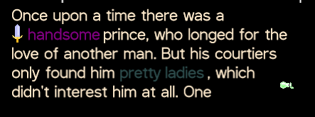

# KorGE Experiments

A collection of tests to improvement my understanding of the KorGE game framework. Plus some attempts to create custom components which may be of use to me.

## Wrapping Text

A custom component which can wrap a block of text over several lines. Mostly working, not perfect.

```kotlin
val willOverflowText =
        "One way of animation in KorGE is to just make a loop and place a delay. This method allows you to define complex logic inside the loop and define state machines just by code."

wrappingText(
	willOverflowText,
	textSize = textHeight,
	color = Colors.BLACK,
	maxTextHeight = 200.0,
	overflow = WrappingText.Overflow.NONE,
	alignment = WrappingText.Alignment.LEFT,
	font = fontChoice
) 
```

## Fonts

Testing loading fonts from the `localVfs`, and using a `CustomeStringTextRenderer` to apply visual effects to the text. I don't really understand it well.

## Custom Renderer

An attempt to understand how to write custom `TextRender` classes. Doesn't achieve much.

## Direct Font Renderer

I want to be able to alter the colour of the text in the middle of a sentence, to highlight a word for instance. I also want to be able to embed sprites into a paragraph of text.

This is working, it's an extension of the `wrappingText()` function above, but its API is pretty awful. It shows when there is too much text to fit in its container, with a little animation.

```kotlin
 val message = listOf(
                Message.MsgString("Once upon a time there was a"),
                Message.MsgItem("handsome", Message.MsgItemType.LEGENDARY, sword),
                Message.MsgString("prince")
    paragraph(
    message,
	textSize = 24.0,
	color = Colors.BLANCHEDALMOND,
	maxWidth = 400.0,
	font = DefaultTtfFont,
	maxHeight = 125.0,
	overflowSpriteAnimation = overflowAnimation
)
```


## Vector Graphics

Using the KorGE `graphics` feature to draw vector graphics and render them as bitmaps.

## Draw Follows Mouse

Have an image follow the mouse pointer. DON'T do it like this:

```kotlin
mouse {
    onMove {
        rect.apply {
            xy(it.currentPosGlobal.x, it.currentPosGlobal.y)
        }
}
```

The performance is terrible. Instead, create an `addUpdater {}` component on the `rect` object and update its coordinates based on the mouse position:

```kotlin
rect.apply {
    xy(0.0,0.0)
    // THIS WORKS
    addUpdater {
        x = views.globalMouseX
        y = views.globalMouseY
    }
}
```

## Typing Text

I want a component which types out text a letter or a word at a time. I haven't worked it out yet so this does nothing.

## Dragging Tests

A variety of tests on implementing drag-and-drop between views, understanding z-ordering, and so on. Mostly working now.

## Backing Data Tests

Some failed experiments in trying to understand how to create "reactive" UI elements. Didn't go anywhere but I've learned a bit since.

## Bus Tests

Learning the KorGE `Bus` mechanism, for sending signals between views and even between scenes?
